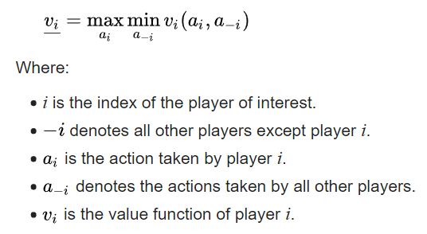

# Chess Engine X

**last updated 24/08/19** || *still a work in progress*

Research related to chess engines
------

#### Minimax
+ It is a decision rule
+ Used for minimizing the possible loss for a worst case (maximum loss) scenario
+ When dealing with gains, it is referred to as "maximin", maximize the minimum gain
+ The maximin value of a player is the highest value that the player can be sure to get without knowing the actions of the other players; equivalently, it is the lowest value the other players can force the player to receive when they know the player's action.
+ Formal definition of maximin: 
+ Calculating the maximin value of a player is done in a worst-case approach: for each possible action of the player, we check all possible actions of the other players and determine the worst possible combination of actions—the one that gives player i the smallest value. Then, we determine which action player i can take in order to make sure that this smallest value is the highest possible.
+ The minimax value of a player is the smallest value that the other players can force the player to receive, without knowing the player's actions; equivalently, it is the largest value the player can be sure to get when they know the actions of the other players.
+ Formal definition of minimax: 

#### Alpha-beta pruning
+ A search algorithm that seeks to decrease the number of nodes that are evaluated by the minimax algorithm in its search tree.
+ It stops evaluating a move when at least one possibility has been found that proves the move to be worse than a previously examined move. Such moves need not be evaluated further. When applied to a standard minimax tree, it returns the same move as minimax would, but prunes away branches that cannot possibly influence the final decision.
+ Illustration of alpha-beta pruning: 
+ Pseudo-code for depth limited minimax with alpha-beta pruning: 

Sources
------

#### Research
+ [Wikipedia page for minimax](https://en.wikipedia.org/wiki/Minimax)
+ [Wikipedia page for alpha-beta pruning](https://en.wikipedia.org/wiki/Alpha%E2%80%93beta_pruning)

#### Tutorials
+ [Series of YouTube tutorials by Bluefever Software on implementing a chess engine in pure JavaScript](https://www.youtube.com/watch?v=2eA0bD3wV3Q "First video")
+ [Article on implementation of a chess engine by freeCodeCamp](https://en.wikipedia.org/wiki/Alpha%E2%80%93beta_pruning)

#### Code
+ [https://github.com/lhartikk/simple-chess-ai](https://github.com/lhartikk/simple-chess-ai)
+ [https://github.com/oakmac/chessboardjs/](https://github.com/oakmac/chessboardjs/)
+ [Final result from freeCodeCamp tutorial](https://jsfiddle.net/q76uzxwe/1/)
